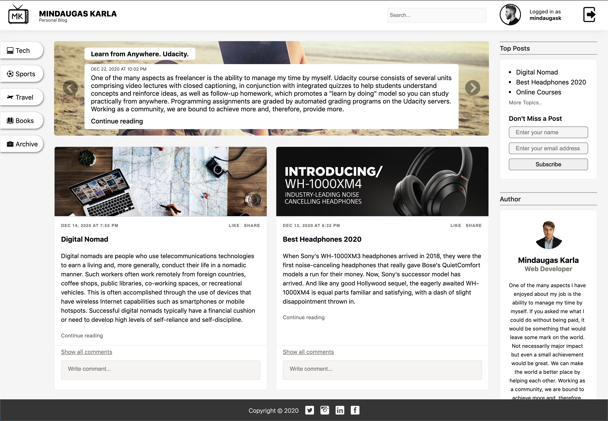
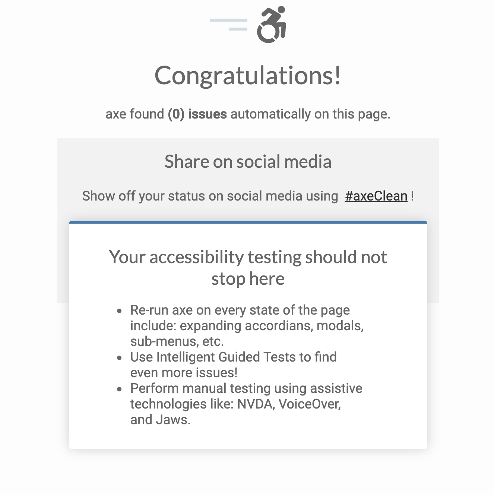

# Project 1: Personal Blog
### Udacity Front End Developer Nanodegree Program

This project requires to utilize HTML and CSS skills to build out a personal blog website, including custom images, layout, and styling. Along with webpage design considerations, needs to appropriately structure your files, as well as use proper CSS and HTML formatting & style.

## Requirements

This project was evaluated by a Udacity code reviewer according to the Personal Blog Website project rubric. Rubric for detailed project requirements prior to submission.

## Results

Personal blog website designed and built from scratch using HTML and CSS. Layouts are made with CSS grid along with flexbox. This project is made as part of the Udacity Front End Developer Nanodegree Program.

### Preview Links
Personal blog website preview links are active. From homepage you can navigate to any of these pages and back. Some links, and futures like search, buttons, sort lists are fake and lead to Blog page. 

- [Personal Blog: Homepage](https://mindaugas-karla.github.io/Front-End-Web-Developer-Nanodegree/project-1-personal-blog-website/personal_blog_website/index.html)
- [Personal Blog: Blog](https://mindaugas-karla.github.io/Front-End-Web-Developer-Nanodegree/project-1-personal-blog-website/personal_blog_website/blog.html)

### Mobile Homepage

### Website Homepage (Mini)

### Website Homepage (Medium)

### Website Homepage (Full)

### Website Blog (Full)

### Axe Test

## References
In addition to the Udacity course materials, I got helpful tips for creating this website from the following articles and resources: (pakeisti teksta)
- [Design System](https://www.forumone.com/ideas/what-is-design-system/)
- [Web Dev](https://web.dev/)
- [Axe Tester](https://axe.deque.com/)

- [Breaking Down How A Nanodegree Program Works](https://blog.udacity.com/2016/05/breaking-down-how-a-nanodegree-program-works.html)
- [Digital Nomad](https://en.wikipedia.org/wiki/Digital_nomad)

## Images/Icons

- [Icons](https://www.iconsdb.com/)
- [Pictures](https://unsplash.com/s/photos/nomad)
