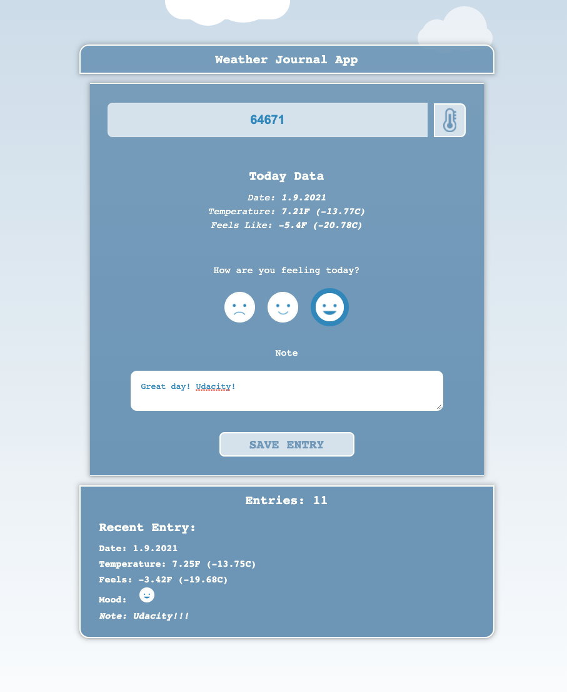

# Project 3: Weather Journal App
##### Udacity Front End Developer Nanodegree Program


## Requirements
This project requires you to create an asynchronous web app that uses Web API and user data to dynamically update the UI for a Weather-Journal App.


## Developement Strategy Used :speech_balloon:
- [x] 
- [x] 
- [x] 

- [x] Suggested tasks:
    - 
    - 
    

## Architecture
The project have a structure like the one shown below. App successfully renders a home page with clear design and functionality added when index.html is loaded in the browser. No errors displayed in console.


```
css
- styles.css    
index.html
js
- app.js
../README.mdn
```

## Technologies Used
- Html
- Css
- JavaScript


## Results
Landing page designed and built from using template produced by **Udacity**: 'refresh-2019' clone branch on Github.




### Preview Links
Landing Page preview links are active. From generated link you can view active Landing page.

- [Landing Page: Index](https://mindaugas-karla.github.io/Front-End-Web-Developer-Nanodegree/project-2-landing-page/landing_page/index.html)
