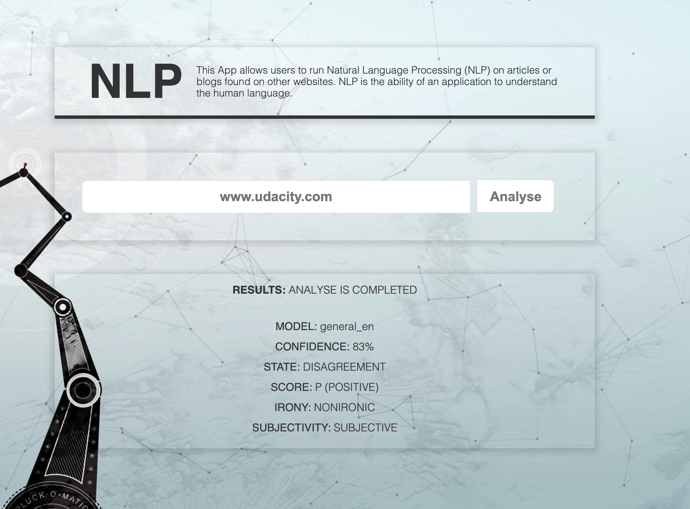

# Project 4: News Article NLP
##### Udacity Front End Developer Nanodegree Program
Following are the project prerequisites:
- Webserver - Node
- Web application framework for routing - Express
- Build tool - Webpack. Using webpack, we will set up the app to have dev and prod environments, each with their own set of tools and commands.
- External script - Service Worker
- External API - Meaningcloud

## Requirements
This project requires you to build a web tool that allows users to run Natural Language Processing (NLP) on articles or blogs found on other websites. NLP is a subset of AI that provides computers ability to process or interact with natural human speech. In NLP, machine learning and deep learning are used on massive amounts of data to obtain the rules and understanding of nuance in human speech.


## This project helped with :speech_balloon:
- [x] Setting up Webpack
- [x] Sass styles
- [x] Webpack Loaders and Plugins
- [x] Webpack Loaders and Plugins
- [x] Creating layouts and page design
- [x] Service workers
- [x] JEST Unit tests

## Developement Strategy Used :speech_balloon:
- [x] Set up with Webpack, Express, Node, and Sass, and Service Workers
- [x] Separated dev and prod configurations for Webpack
- [x] Developer environment set up with the Webpack dev server
- [x] Added one form field
- [x] Created request to the Meaningcloud API
- [x] Used Sass for styling
- [x] Used Minify js and styles in the production environment
- [x] Added response from the API to the view for a user to see 
- [x] Added Service workers to be able to show content offline


## Technologies Used
- Html
- Css
- JavaScript
- Node
- Express
- Webpack
- Jest
- Workbox
- Meaningcloud API


## Results
Before Analyse


After Analyse



### Deployment
To get the project up and running follow the steps below:
- Open Terminal & navigate to project folder
```
cd project-4-nlp-article
cd evaluate-4-nlp-article
```
- To set up project environment, make sure that the Node and packages (Express, Cors and Body-Parser) installed, and which are used to create the server. Install all dependencies to run.
```
npm install
```

## Build
# Production environment
```
npm run build-prod
npm run start
```

# Developement environment
```
npm run build-dev
```

View the project by opening browser at http://localhost:8082/

## Testing

```
npm run test
```


### Also Used
Meaningcloud - Sentiment Analysis API: 
- [Sentiment Analysis version 2.1](https://learn.meaningcloud.com/developer/sentiment-analysis/2.1)


Background animation by Julian Laval:
- [Codepen.io Code](https://codepen.io/JulianLaval/pen/KpLXOO)


Free background wallpaper:
- [Wallpaperaccess](https://wallpaperaccess.com/minimalist-robot)


