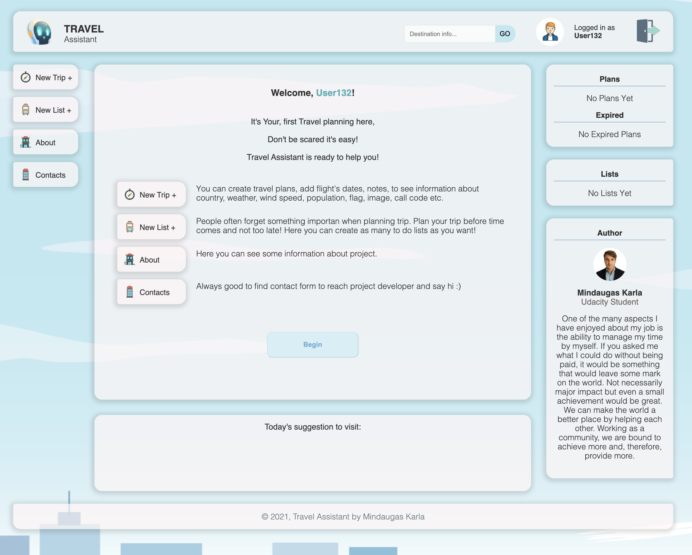

# Project 7: Travel Assistant
##### Udacity Front End Developer Nanodegree Program


Following are the project prerequisites:
- Webserver - Node
- Web application framework for routing - Express
- Build tool - Webpack. Using webpack, we will set up the app to have dev and prod environments, each with their own set of tools and commands.
- External script - Service Worker
- External API - Geonames, WeatherBit, Pixabay and Restcountries
- HTML structure


## Requirements
This project aims to give an opportunity to put all of the skills participant learned into one project to build own custom travel app. Due to the nature of this course, it is very JavaScript heavy, but it is still expected to write clean and appealing HTML/CSS. Participant has targeting the DOM, working with objects, and retrieving data from 3 APIs in which one of those is reliant on another to work. Finally, this is all done in a Webpack environment, using an express server, and wrapped up with service workers.


## Travel Assistant
Travel Assistant is a powerful tool to plan your Trips. You can create travel plans, add flight's dates, create to do lists. To lists is a good way to Reach new productivity peak! People often forget something importan when planning trip. Plan your trip before time comes and not too late! Here you can create as many to do lists as you want! This app was created as part of Udacity Nano Degree program as final project.

## This project helped with :speech_balloon:
- [x] Setting up Webpack
- [x] Sass styles
- [x] Webpack Loaders and Plugins
- [x] Webpack Loaders and Plugins
- [x] Creating layouts and page design
- [x] Service workers
- [x] JEST Unit tests

## Developement Strategy Used :speech_balloon:
- [x] Set up with Webpack, Express, Node, and Sass, and Service Workers
- [x] Separated dev and prod configurations for Webpack
- [x] Developer environment set up with the Webpack dev server
- [x] Added one form field
- [x] Created request to the Meaningcloud API
- [x] Used Sass for styling
- [x] Used Minify js and styles in the production environment
- [x] Added response from the API to the view for a user to see 
- [x] Added Service workers to be able to show content offline


## Optional tasks completed :speech_balloon:

- [x] Add end date and display length of trip.
- [x] Pull in an image for the country from Pixabay API when the entered location brings up no results (good for obscure localities).
- [] Allow user to add multiple destinations on the same trip.
- [x] Pull in weather for additional locations.
- [x] Allow the user to add hotel and/or flight data.
- [] Multiple places to stay? Multiple flights?
- [x] Integrate the REST Countries API to pull in data for the country being visited.
- [x] Allow the user to remove the trip.
- [x] Use Local Storage to save the data so that when they close, then revisit the page, their information is still there.
- [] Instead of just pulling a single day forecast, pull the forecast for multiple days.
- [x] Incorporate icons into forecast (Student: Incorporated into weather).
- [x] Allow user to Print their trip and/or export to PDF.
- [x] Allow the user to add a todo list and/or packing list for their trip.
- [x] Allow the user to add additional trips (this may take some heavy reworking, but is worth the challenge).
- [x] Automatically sort additional trips by countdown (Student: by list display in the widgets).
- [x] Move expired trips to bottom/have their style change so it’s clear it’s expired.

## Added modifications by me :speech_balloon:
- [x] Mimic Log In using internal storage.
- [x] Created User Profile.
- [x] Created mini Platform to use application.
- [x] Multiple To Do Lists.
- [x] Live Preview Travel Builder.
- [x] Search Bar in header to investigate country before adding to trip.
- [x] Validation for inputs.
- [x] Process Messages.
- [x] Close button for popups.
- [x] Contact, About Sections, Widgets and bottom Info Sections.


## Technologies Used
- Html
- Css
- JavaScript
- Node
- Express
- Webpack
- Jest
- Workbox
- API: Geonames, WeatherBit, Pixabay and Restcountries


## Results
Log In Menu


Profile Icon Selection


Welcome message for the first time joining platform


New Trip Plan with Live Preview


Loaded Trip


Print or Save to Pdf


Create List Section


About Section


Contacts Section


### API Used
This project using 4 API Geonames, WeatherBit, Pixabay and Restcountries.

- To set API you need to create a file named .env with the following code and your API credentials.
```
API_KEY_GEONAMES = geoname USERNAME
API_KEY_WEATHERBIT = API KEY
API_KEY_PIXABAY = API KEY
```


### Deployment
To get the project up and running follow the steps below:
- Open Terminal & navigate to project folder
```
cd project-7-travel-app
cd travel-app
```
- To set up project environment, make sure that the Node and packages (Express, Cors and Body-Parser) installed, and which are used to create the server. Install all dependencies to run.
```
npm install
```

## Build
### Production environment
```
npm run build-prod
npm run start
```

### Developement environment
```
npm run build-dev
```

View the project by opening browser at http://localhost:8082/

## Testing

```
npm run test
```


### Also Used
Geonames API: 
- [Geonames](https://www.geonames.org/)


Weatherbit API:
- [Weatherbit](https://www.weatherbit.io/)


Pixabay API:
- [Pixabay](http://pixabay.com/)

Restcountries API:
- [Restcountries](https://restcountries.eu/)

Robot Images from Freepik.com Designed by upklyak
- [Freepik](http://www.freepik.com/)

Logout Icon Designed by rawpixel.com
- [Freepik](http://www.freepik.com/)

Buttons Icons from Enginetemplates
- [Enginetemplates](https://enginetemplates.com/set-of-20-high-quality-travel-free-icons/)


### Author
- [Mindaugas Karla](https://www.linkedin.com/in/mindaugas-karla/)
